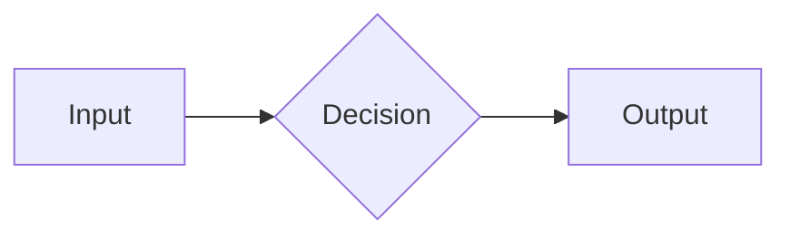

# Quick Start: MCP Delegation (5-Step Execution)

**Use this before every delegation task. Estimated prep: 2 minutes.**

---

## Pre-Flight Checklist (STOP if any unchecked)

- [ ] Scope clear? (what's in/out, time limit, file count)
- [ ] Local work done? (grep/scan/index if applicable)
- [ ] Protocol drafted? (root message written)
- [ ] Files ready? (@attach# indices prepared)
- [ ] Models chosen? (max 3-4, who does what)
- [ ] Output format defined? (table/checklist/diagram)

**If ANY box unchecked → STOP. Prepare that first. Do not proceed to Step 1.**

---

## Step 1: Create Chat + Post Root Message (2 min)

**Action:**
```powershell
# Create chat via CQDS UI or MCP
# Copy-paste prepared root message below
# NOTE: Wait 3 seconds for chat to stabilize (do not tag models yet)
# Continue only after status becomes "stable"
```

**Root Message Template** (copy-paste and customize):
```
PROJECT: [ProjectName]
TASK: [ConciseName]
SCOPE: [What's in, what's out]

CONTEXT:
- Project index: @attach#[ID]
- Key files: @attach#[ID1], @attach#[ID2], @attach#[ID3]
- Documentation: [Link to policy]

BOUNDARIES:
- File list limited to: [names/patterns]
- Do NOT modify: [configs/secrets/etc]
- Time budget: [e.g., 10 minutes]
- Output format: [table/checklist/markdown/diagram]

POLICY/RULES:
- [Key rule 1]
- [Key rule 2]
- Severity scale: critical | high | medium | low
- Anonymization: use [HOST_CORE], [ACCOUNT_A], not real values

EXPECTED OUTPUT:
1. [Specific table/list structure]
2. [Specific checklist format]
3. [Summary format]
```

**Verification**: Root message visible in chat, no errors, status shows "ready".

---

## Step 2: Echo Test (1 min)

**Action:**
```
@gpt5c @claude4o — confirm you read root message and understand:
1. Scope and boundaries?
2. Output format and rules?
Answer with 1 line each, or ask for clarification.
```

**Expected Response**: Each model confirms in 1 line.

**If model asks for context:**
- **First occurrence**: Refine root message, re-post, retry.
- **Second occurrence**: Change Protocol — consider switching to direct wiki instead.
- **Max retries**: 2 times total.

**If models confirm**: Proceed to Step 3.

---

## Step 3: Assign Sub-Tasks (1 min per task)

**Action** (post ONE message with all sub-tasks):
```
@gpt5c: [Specific deliverable 1] — Time: [5 min]

@claude4o: [Specific deliverable 2] — Time: [5 min]

@grok4f: [Specific deliverable 3] — Time: [5 min]
```

**Guidelines**:
- One line per model (keep it tight, no elaboration).
- Include time budget per task.
- NO follow-up comments (single message only).
- Example (code review):
  ```
  @gpt5c: Analyze [@attach#10, @attach#11] for security issues.
  Output: table (severity | file | issue | impact | fix).
  Time: 5 min.
  
  @claude4o: Rate confidence for each finding + propose checklist (7 steps).
  Time: 5 min.
  
  @grok4f: Cross-check outputs. Any false positives?
  Output: bullet list (confirmed | hypothesis | false_positive).
  Time: 5 min.
  ```

---

## Step 4: Wait & Collect Results (varies)

**Action**:
- Set timer for longest time budget + 1 min.
- When done: Execute `cq_get_history(chat_id=X)` to fetch JSON.
- Copy results.

**Monitoring**:
- If any model asks for more context: consider adding clarification, but prefer to move on (time budget is ticking).
- If a model says "skip" or "no findings": that's valid output, include in synthesis.

---

## Step 5: Synthesize & Commit (2-5 min)

**Action**:
1. **Merge** outputs into single artifact:
   - Consolidate tables (no duplicate rows).
   - Combine checklists.
   - Merge markdown sections.
   - Combine findings.
2. **Validate**:
   - No contradictions between models.
   - All required output sections present.
   - Anonymization rules respected (no real IPs/hosts/secrets).
3. **Save**:
   - To memory (`/memories/session/` or `/memories/repo/`).
   - To wiki (`/docs/wiki/` in repo).
   - To git commit message.
4. **Commit**:
   ```powershell
   git add [results_file]
   git commit -m "chore: [task_name] — MCP delegation round N, [brief_summary]"
   ```

---

## Model Quick Reference

| Task | Primary | Secondary | Time |
|------|---------|-----------|------|
| Find bugs | `gpt5c` | `grok4f` | 5 min |
| Structure | `claude4s` | `gpt5c` | 5 min |
| Creative | `claude4s` | `gpt5c` | 10 min |
| Security | `claude4o` | `gpt5c` | 5 min |
| Patterns | `grok4f` | `gpt5n` | 3 min |
| Diagrams | `claude4o` | `gpt5c` | 5 min |

---

## Output Format Templates

### Table (Findings)
```
| severity | file | issue | impact | fix |
|----------|------|-------|--------|-----|
| high | foo.php | missing validation | crash on edge case | add input check |
| medium | bar.ts | auth delay | UX lag | cache results |
```

### Checklist
```
- [ ] Step 1: description
- [ ] Step 2: description
- [ ] Step 3: description
```

### Markdown Structure
```
## Page Title
**Purpose**: [one line]

**Sections**:
- Intro
- Details  
- Conclusion
```

### Mermaid Diagram
````

````

---

## Abort Scenarios (When to BAIL)

1. **Echo test fails twice** → Context not loading. Switch to direct wiki/cli tools.
2. **No response after 10 min** → Queue overload. Try a different chat or project.
3. **Model asks for files again** → Root message needs more detail. Rewrite + retry ONE.
4. **Output contradicts prior** → Models diverged. Run cross-check task or escalate.
5. **Token meter running wild** → Context bloated or sync mode stuck. Reset chat.

**Fallback**: Split task into smaller, serial sub-tasks instead of parallel.

---

## Token Watch (Alert if Exceeded)

- **1K tokens** — Finding check (should take <1 min).
- **3K tokens** — Full structure (should take 5-10 min).
- **5K tokens** — Complete wiki (should take 15 min).
- **If burn rate 2x expected**: STOP, debug root message or model choice.

---

## Post-Execution Checklist

- [ ] Results consolidated into single artifact.
- [ ] Results saved to memory and/or wiki.
- [ ] Changes committed to git.
- [ ] Backlog task marked done (if applicable).
- [ ] Time/cost recorded for next cycle reference.

---

## Common Anti-Patterns (Avoid These)

❌ Start without root message → models speculate.  
❌ Tag all models at once (@all) → serialization blocked + redundancy.  
❌ Dump full project files → context bloat.  
❌ Expect LLM to find patterns → use grep, ask LLM to judge.  
❌ Retry same approach twice → change approach if first fails.  
❌ Leave results scattered → consolidate into one artifact.

---

## Time Budget (Typical Projects)

- **Simple checklist**: 2-3 min (1 model).
- **Code review (1-5 files)**: 5-10 min (2-3 models).
- **Security audit (10+ files)**: 15 min (3-4 models).
- **Wiki generation (8-10 pages)**: 15 min sequential (3 models, A→B→C).
- **Sanitization (100s files)**: 10 min (grep + 1 model validate).

---

## Next Scheduled Review

**When**: April 4, 2026 (one week after this pilot).  
**What**: Apply protocol v2 to actual TradeBot sanitization (P0 files).  
**Metric**: <15 min, <5K tokens, clear pass/fail per finding.  
**Compare**: Measure vs. March 28 pilot (was 45 min, 15K tokens).

