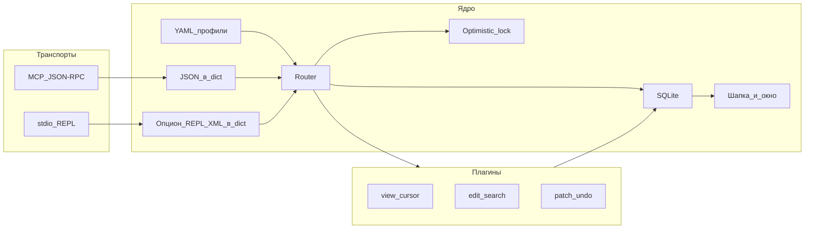

# MCP Text Editor Plan (validated via MCP tool)
name: MCP text_editor локальный
overview: "Стадия 1: локальный редактор; JSON-op; response_mode; UX без лишних help; YAML-профили; хранилище: общий registry.sqlite + отдельный SQLite на сессию; пул text_lines + журнал revision_history; отдельный MCP-сервер."
todos:
  - id: package-core
    content: "Пакет text_editor: registry.sqlite + session-*.sqlite; text_lines + revision_history; материализация текущей ревизии; lock/viewport/router; YAML-профили"
    status: pending
  - id: stdio-repl
    content: "Stdio REPL; опциональный парсер XML-like только для не-MCP входа"
    status: pending
  - id: plugins-v1
    content: "Плагины JSON-op: open (profile, response_mode_default), close/status, get_view, move_cursor, replace_*, apply_patch, undo/redo, checkpoints; response_mode; diagnostics; search_indexed; format_range; ошибки с подсказками без отдельного help"
    status: pending
  - id: mcp-standalone
    content: "Отдельный MCP Server: session_open (JSON) + session_cmd (JSON: op + op_args + expected_revision); JSON Schema / oneOf по op"
    status: pending
  - id: tests
    content: "Тесты: lock, dry_run, viewport, JSON-op; профили; response_mode/response_as; восстановление ревизии из revision_history; пул text_lines idx=0"
    status: pending
---

# MCP `text_editor`: локальная стадия 1

Каноническая копия черновика плана: этот файл в `P:/opt/docker/docs/`. Рабочие заметки в репозитории: `P:/opt/docker/cqds/mcp-tools/text_editor/PLAN.md`.

## Цели первой стадии

- Только **локальные пути хоста** (`path`), без Colloquium/CQDS HTTP.
- **SQLite**: см. раздел **«Хранилище»** — общий реестр сессий + отдельный файл БД на сессию; история через **пул строк** и **журнал ревизий** (не полные BLOB на каждую ревизию). **Optimistic lock** по `revision`, **компактный diff** в ответе, **окно** (дефолт 80 строк, курсор по центру 40+1+39), **soft-wrap только в рендере**, **шапка**, пресеты `small|normal|large`, **безопасность** (dry_run, лимиты, `confirm`). Опционально позже — **снапшоты** для ускорения отката на далёкие ревизии.
- **MCP `description`**: кратко; детали — встроенная справка (например `op: "help"` или отдельный минимальный ответ).

## Профили редактирования (YAML)

Цель: связать **тип файла** (по расширению и/или имени), **проверку синтаксиса**, **правила отступов** и опционально **форматирование** в одном декларативном месте, чтобы `session_open` мог принять **`profile_id`** или **авто** по пути файла.

### Содержимое профиля (логические поля)

- **`id`** — стабильное имя профиля (например `python`, `yaml-soft`).
- **`match`** — критерии применения: список расширений (`py`, `pyw`), опционально globs по имени файла; порядок в каталоге профилей определяет приоритет при конфликте (первый выигрыш или явный `priority: int`).
- **`syntax_check`** — как запускать внешнюю проверку (не интерактивно): например `command: [string, …]` с плейсхолдером `{path}` к **временной копии** снимка сессии или к файлу на диске (политика на реализации); `timeout_sec`, `cwd` опционально. Результат: код возврата + stdout/stderr в ответ `diagnostics`.
- **`indent`** — режим: **`strict`** (нарушения таб/пробелы, смешение, не кратно `tab_width` → предупреждения/ошибки в diagnostics), **`soft`** (только заметные аномалии или смешение в одной строке), **`off`** (не проверять отступы).
- **`tab_width`** / **`indent_unit`** — ожидаемые числа пробелов или маркер `tab` для strict/soft.
- **`format`** (опционально) — та же идея, что `syntax_check`: команда или путь к исполняемому; для `format_range` в v1 может быть пусто.

Встроенный набор профилей (минимум) + пользовательские файлы поверх.

### Размещение и загрузка

- Каталог по умолчанию, например рядом с пакетом `text_editor/profiles/*.yml` + опционально **`TEXT_EDITOR_PROFILES_DIR`** (или список через `PATH`-подобный разделитель) — только **доверенные** пути; файлы из произвольных путей из MCP **не** подгружать без allowlist.
- При старте сервера: слить профили, провалидировать схему (минимальная проверка полей + запрет пустого `command` с подстановкой shell из сессии).

### Выбор профиля при `session_open`

Порядок разрешения (от сильного к слабому):

1. Явный аргумент **`profile_id`**, если профиль существует.
2. Иначе **`profile_auto: true`** (по умолчанию можно `true`): первый профиль, чей `match` покрывает расширение basename открытого `path`.
3. Иначе профиль **`default`** из конфигурации; если нет — встроенный `plain` (только EOL/encoding, indent `off`, без syntax_check).

В сессии SQLite хранить **`resolved_profile_id`** и кэш разобранного профиля (или ссылку на версию файла yml для инвалидации).

### Связь с командами

- **`diagnostics`**: объединить вывод **`syntax_check`** из профиля (если задан) с встроенными проверками (trailing spaces, скобки-эвристика, EOL); для `indent: strict|soft` — правила из профиля.
- **`format_range`**: если в профиле задан `format`, вызывать по политике безопасности (timeout, только выделение); иначе заглушка.
- Шапка окна (опционально в стадии 1): строка **`profile: <id>`** для прозрачности.

### Безопасность профилей

- Команды из YAML — **фиксированный allowlist** шаблонов или явно перечислённые бинарники; не подставлять в команду произвольные строки из содержимого файла кроме контролируемого `{path}`.
- Лимиты времени и размера вывода проверки; при падении checker — понятная ошибка в `diagnostics`, без утечки секретов в stderr в прод-режиме (опционально усечение).

## MCP: JSON — единственный обязательный язык операций

Все вызовы **`session_open`** и **`session_cmd`** (или эквивалентные имена инструментов) описываются **JSON-объектами**, валидируемыми схемой (желательно **JSON Schema** с `oneOf` / `discriminator` по полю **`op`**).

Принципы:

1. **`op`** — строковый идентификатор операции (`get_view`, `replace_range`, `apply_patch`, …).
2. **`op_args`** — объект **только JSON-типов** (строки, числа, bool, массивы, вложенные объекты). Никаких обязательных XML-строк в MCP для редактирования.
3. **`expected_revision`** (integer) обязателен для любой мутации; чтение может разрешать опускание по политике, но лучше единообразно требовать и для чтения «с привязкой к версии».
4. **Тяжёлый текст** (unified diff, большая вставка, длинный regex): не раздувать экранирование в JSON — поля **`patch_b64`**, **`text_b64`**, или **`patch_path` / `text_path`** (путь на хосте). Это часть JSON-контракта, а не «второй язык разметки».
5. **Многострочные замены**: предпочтительно **`replacement_lines`: string[]** или один **`replacement_text`** + явное указание конца строк; избегать неоднозначных escape-лестниц внутри одной гигантской строки.
6. **Пакетные правки**: опционально **`requests`: [{ "op", "op_args", "expected_revision" }]`** с чёткими правилами продвижения `revision` между шагами.

Итог: модель и клиент опираются на **предсказуемую схему** и автогенерацию; сбои локализуются в «невалидный JSON / неверный `op` / несовпадение revision».

## Экономия round-trip: модель без справки на каждую мелочь

Лимиты **rate-limit** на вызовы инструментов делают отдельный `help` на каждый вопрос нежелательным. Принципы:

1. **Сильные умолчания**: `response_mode` по умолчанию `viewport`; профиль — авто по расширению; «опасные» операции уже оговорены (`dry_run` для regex/patch и т.д.). Типичный сценарий — один `session_open` и серия `session_cmd` **без** смены режимов.
2. **Краткая карточка в ответе `session_open`**: помимо `session_id` и `revision` — компактный блок **`session_defaults`** (или аналог): какой профиль разрешён, какой `response_mode_default` активен, лимиты, enum допустимых `op` **одной строкой** или коротким массивом.
   - При запросе от модели через входящий `capabilities_hint` (CSV-ключевые слова) вернуть в ответе блок **`capabilities_guide`** с краткими контрактами по выбранным темам (`navigation`, `search`, `replace`, `patch`, `validation`, `undo`, `redo` и т.п.).
   - Для reopen/повторного open добавлять мини-журнал **`recent_ops`**: последние 3-5 операций (кратко), чтобы модель не делала «слепой» повтор действий.
3. **Ошибки как мини-справка**: при неверном `op`, `response_mode` или revision-mismatch тело ошибки включает **`allowed`**, **`hint`**, **пример одной строки JSON** с исправлением — без второго вызова инструмента.
4. **JSON Schema**: у каждого поля осмысленный `description` (значения enum, когда менять `response_mode`) — клиенты лучше подставляют аргументы, реже промахиваются.
5. **Батч `requests[]`**: несколько шагов за один вызов `session_cmd` — меньше round-trip под лимит.
6. **`op: "help"`** или узкий инструмент справки — **редкий** путь; не требовать для базовой работы.

Параметр запроса руководства:

- `session_open.op_args.capabilities_hint`: string (CSV), например `"navigation,replace,patch"`.
- Сервер парсит ключевые слова и возвращает `capabilities_guide` только по выбранным разделам.
- Тот же параметр (`capabilities_hint`) использовать в `help`-инструменте/`op: "help"` для консистентного поведения.

Параметры мини-журнала:

- `session_open.op_args.include_recent_ops`: boolean (default `true` для reopen, `false` для нового файла).
- `session_open.op_args.recent_ops_limit`: integer (default `3`, max `5`).
- Формат `recent_ops` — компактный список объектов: `{ revision, op, changed_lines, ts }`, без diff/длинных payload.
- Если запись слишком длинная, усекать и ставить `truncated=true` в элементе.

## Режим вывода результата после правок (`response_mode`)

**Имеет смысл.** После мутаций агенту не всегда нужен один и тот же объём текста: иногда достаточно **контекста у курсора**, иногда — **полный diff** или **словарь затронутых строк**. Управление режимом снижает **токены** и риск «утонуть» в diff.

**Имена в схеме**:

- Каноническое поле: **`response_mode`** (строковый enum).
- Допустимый синоним на входе: **`response_as`** — то же значение; сервер **нормализует** в `response_mode` до роутера, чтобы в логах и ответах был один ключ.
- Слово **`checkout`** не использовать (путаница с VCS).

### Уровни задания

1. **`session_open`**: опционально **`response_mode_default`** — режим для последующих `session_cmd`, пока не переопределён.
2. **`session_cmd`**: опционально **`response_mode`** (или **`response_as`**) — на одну операцию или на весь батч `requests[]` (политика: либо один режим на весь batch, либо поле внутри каждого элемента `requests[]` — выбрать при реализации и зафиксировать в схеме).

### Режимы (стадия 1)

| Значение `response_mode` | Поведение |
|--------------------------|-----------|
| **`viewport`** (по умолчанию) | После мутации в теле ответа — **окно** как у `get_view` (шапка + строки вокруг курсора после правки; якорь при неподвижном курсоре — зафиксировать). |
| **`numbered_lines`** | Тот же фрагмент, что у `get_view`, но в формате **нумерованного списка строк** с wrapped-view структурой: `line_num -> string` (если строка влезает в ширину) или `line_num -> string[]` (массив фрагментов при переносе). Подходит для прицельных блочных правок и точечного diff. |
| **`full_diff`** | **Unified diff** операции (или батча — согласовать); лимиты **max_bytes** / усечение. |
| **`changed_lines`** | Объект **`{ "номер_строки": "новое содержимое или null", … }`** только для изменённых строк (1-based); опции усечения длинных строк. |
| **`minimal`** | Шапка + **`current_revision`/`previous_revision`**, счётчики (`lines_changed`, …), без тела файла. |

Независимо от `response_mode`, для любой мутации в структурированной части ответа **всегда**: **`current_revision`**, **`previous_revision`**, при мутации — **`compact_diff`** или **`hunks_meta`**.

Для `undo`:

- `previous_revision` семантически трактуется как **`redo_revision`** (undo-of-undo target);
- для удобства клиента допустим явный алиас поля `redo_revision` (равен `previous_revision`).

### Когда какой режим

- **`viewport`** — основной режим по умолчанию.
- **`numbered_lines`** — когда модель готовит прицельный блоковый diff/patch по номерам строк.
- **`full_diff`** / **`changed_lines`** — точечно, когда нужен аудит.
- **`minimal`** — плотные цепочки шагов.

### Ограничения

- При **`dry_run: true`** не дублировать два больших поля preview; **`response_mode`** влияет на один согласованный канал вывода.
- **`max_response_*`** на сессию против случайного огромного `full_diff`.
- Ввести дефолтные лимиты вывода на уровне параметров сессии (консервативные):
  - `default_max_view_lines = 80`,
  - `hard_max_view_lines = 120` (200+ не использовать по умолчанию),
  - `max_numbered_lines = 120`,
  - `max_wrapped_segments_per_line = 12`,
  - `max_line_chars_per_segment` по `wrap_width`.
- При превышении лимита возвращать усечённый результат с `truncated=true` и метаданными (`returned_lines`, `total_candidate_lines`), чтобы модель не пыталась парсить «потерянный» хвост из логов.

## REPL и XML (вне обязательного MCP)

- **stdio REPL** (и будущий удалённый адаптер, см. FastAPI в фазе 2) может принимать **текстовые** команды; при желании — **XML-like** для паритета с `P:/opt/docker/cqds/agent/processors/block_processor.py` (`_parse_attrs`).
- Транспорт REPL переводит это в **тот же внутренний dict**, что и MCP после `json.loads` — **один router**, два входных адаптера.
- В MCP **не требовать** полей `cmd_xml`, псевдокавычек `¨` и т.п. в стадии 1; при появлении совместимости — только как **необязательный** вторичный вход, не влияющий на основную схему.

## Архитектура: ядро vs плагины



- Каталог реализации: `P:/opt/docker/cqds/mcp-tools/text_editor/` — сессии, ревизии, рендер, router, регистрация плагинов по **`op`**.
- Плагины: `mcp-tools/text_editor/plugins/`.

## Пример форм (иллюстративно, не финальная схема)

- `session_open`: `{ "path": "…", "viewport_preset?": "normal", "profile_id?": "python", "profile_auto?": true, "response_mode_default?": "viewport" }`.
- `session_open`: `{ "path": "…", "viewport_preset?": "normal", "profile_id?": "python", "profile_auto?": true, "response_mode_default?": "viewport", "capabilities_hint?": "navigation,replace,patch" }`.
- `session_open`: `{ "path": "…", "include_recent_ops?": true, "recent_ops_limit?": 3 }` -> в ответе `recent_ops` (последние операции в сокращённом виде).
- `session_cmd`: `"response_mode": "numbered_lines"` (или `"full_diff"`, эквивалент через `"response_as"`; перекрывает `response_mode_default`), опционально с параметрами `wrap_width`, `max_view_lines`.
- `session_cmd`: `{ "session_id": "…", "expected_revision": 12, "op": "replace_range", "op_args": { "line_start": 10, "line_end": 15, "replacement_lines": ["…"] }, "dry_run": false, "confirm": true }`.
- `apply_patch`: `{ "op": "apply_patch", "op_args": { "patch_path": "C:/tmp/p.diff" } }` или `patch_b64`.

Для любой модификации ответ обязан содержать: `current_revision`, `previous_revision` (при `undo` допустим алиас `redo_revision`).

## Отдельный MCP-сервер

- Отдельный **Server** в `mcp-tools`, не смешивать с `cqds_mcp_mini` на стадии 1.
- Два инструмента: **открытие сессии** (JSON), **команда** (JSON с `op` / `op_args` / `expected_revision` + b64/path при необходимости).
- В **`description`** инструментов — **одна компактная таблица** (дефолты, значения `response_mode`, обязательные поля); детальная семантика — в JSON Schema и в ответах/ошибках, не в отдельном round-trip к справке.

## Удалённое взаимодействие (закладка)

- В фазе 2 удалённый доступ планируется через **мини-сервер на FastAPI** в контейнере, где нужны правки (локальный сетевой доступ внутри окружения), а не через SSH.
- Мини-сервер выступает транспортным адаптером к тому же `router` и плагинам: HTTP JSON -> внутренний `op/op_args`.
- Требования на фазу 2: сетевой ACL/аутентификация, ограничение origins/сетей, таймауты, лимиты payload и аудит вызовов.
- Хранение БД сессий остаётся локальным для контейнера, где запущен мини-сервер.

## Интеграция в репозиторий cqds

- Entrypoint MCP в `mcp-tools/`; запись в `mcp.json` у разработчика.
- Опционально позже: тонкая обёртка в `cqds_mcp_mini`.

## Команды (приоритет)

Семантика команд задаётся **JSON `op` + `op_args`**:

1. Сессия: `open`, `close`, `status`.
2. `get_view`, `move_cursor`.
3. `replace_range`, `replace_regex`, `apply_patch` (логика контекста — вынести из `P:/opt/docker/cqds/agent/processors/patch_processor.py` / `P:/opt/docker/cqds/mcp-tools/patch_acceptance_math.py` в переиспользуемую библиотеку в пакете `text_editor`).
4. `undo` / `redo`, checkpoints.
5. `diagnostics` (профиль: syntax + indent; плюс общие эвристики), `search_indexed` (для поиска по контенту дополнительно возвращать `first_revision` — ревизию первого появления совпадения).
6. `format_range` — из профиля или заглушка в v1.
7. `save_revision` (или эквивалент): применить текущую ревизию к файлу на диске и выставить флаг `SAVED_TO_DISK`.

## Рабочий цикл с файлом (фаза 1)

Рекомендуемый линейный сценарий работы агента:

1. **Открытие/переоткрытие сессии**
   - `session_open(path, ...)` -> получить `session_id`, `current_revision`, `previous_revision`, `session_defaults`, опционально `recent_ops`.
2. **Навигация и поиск**
   - `get_view` / `move_cursor` / `search_indexed` (при необходимости `response_mode=numbered_lines` для точечной правки).
3. **Правки черновика**
   - `replace_range` / `replace_regex` / `apply_patch` / `insert_from_file` и т.п.
   - каждая операция -> одна новая ревизия (`current_revision` сдвигается).
4. **Валидация черновика**
   - `diagnostics` (и профильный `syntax_check`) на текущей ревизии.
   - при успехе выставить ревизионный флаг `LINT_SUCCESS`.
5. **Сохранение ревизии на диск**
   - `save_revision` записывает текущий снимок в исходный файл.
   - при успехе выставляется `SAVED_TO_DISK`, обновляются source markers (`mtime/size/hash`).
6. **Продолжение или завершение**
   - либо новые правки от сохранённой ревизии,
   - либо закрытие сессии/ожидание следующего `session_open`.

Примечания:

- `dry_run`-операции ревизию не двигают и на диск не пишут.
- `undo` после `save_revision` допустим в сессии; повторное `save_revision` зафиксирует уже новую активную ревизию.

## Хранилище SQLite: реестр, файл на сессию, пул строк и журнал ревизий

### Два уровня файлов БД

| Файл | Назначение |
|------|------------|
| **Общий реестр** (например `registry.sqlite` в каталоге данных редактора) | Метаданные всех сессий: `session_id`, путь к исходному файлу на хосте, `source_path_hash`, `session_db_path`, `current_revision`, таймстемпы, TTL/закрытие, ссылка на профиль, агрегаты для UI (опционально курсор/viewport — см. ниже). |
| **Отдельный файл на сессию** (например `sessions/<session_id>.sqlite`) | Вся **история строк и ревизий** этой сессии. **Cleanup** = удалить файл сессии + запись из реестра — без VACUUM чужих сессий. |

Путь каталога данных: через env (например **`TEXT_EDITOR_DATA_DIR`**), по умолчанию — подкаталог **`mcp_text_editor`** в домашнем каталоге пользователя (`~`), например `~/.mcp_text_editor` (или эквивалент на ОС).

### Идентификатор сессии и правило единственности

- `session_id` должен быть **детерминирован** от полного канонического пути редактируемого файла (в фазе 1 принято `md5(canonical_path_utf8)` как компактный ID).
- В реестре держать уникальность по `source_path_hash` (UNIQUE), чтобы для одного файла существовала одна активная сессия даже при запуске из разных оболочек/процессов.
- При `session_open` для уже существующей сессии возвращать её (или мягко «переоткрывать»), а не создавать дубль.

### Политика автоматической уборки

- Сессия считается stale, если не было записей в файл сессии (или обновления `last_write_at` в реестре) более **30 дней**.
- Cleanup выполняется фоново при старте сервера и периодически (или лениво на `session_open`), удаляя `sessions/<session_id>.sqlite` и соответствующую запись в `registry.sqlite`.
- Для безопасности перед удалением можно проверять «не используется сейчас» (file lock / heartbeat процесса), чтобы не снести активную сессию.

### БД сессии: таблицы

#### `text_lines` — пул всех строк текста, когда-либо участвовавших в файле

- **`idx`** INTEGER PRIMARY KEY — идентификатор текста в пуле.
- **`idx = 0`** зарезервирован для **канонической пустой строки** (единственное содержимое: пустой TEXT). Любая операция «удалить символы строки, оставив пустую» может ссылаться на `0` без дублирования пустых TEXT в таблице.
- **`idx >= 1`** — уникальные вставки: колонка **`text`** (TEXT; политика нормализации перевода строк при записи в пул фиксируется отдельно).
- Опционально позже: **`hash`** / дедуп одинаковых `text` для экономии места.

Пул **append-only** на стадии 1: новая строка = новый `idx`, без переиспользования освобождённых idx (упрощает ссылки из журнала).

#### `revision_history` — журнал построчных атомарных правок

Каждая строка журнала описывает **один атомарный шаг** на уровне «строка документа» (одна операция редактора может породить **несколько** записей с одним и тем же `revision`).

Предлагаемые поля:

| Поле | Смысл |
|------|--------|
| **`seq`** | INTEGER PRIMARY KEY AUTOINCREMENT — **глобальный порядок применения** всех записей (внутри и между ревизиями). |
| **`revision`** | INTEGER NOT NULL — номер **логической ревизии** документа (растёт при успешном commit мутации; все записи одной пользовательской операции разделяют один `revision`). |
| **`line_num`** | INTEGER NOT NULL — **1-based** индекс строки в документе **в состоянии до применения этой записи** (удобно для вставки/замены: сначала позиция, потом delete/add). |
| **`deleted_idx`** | INTEGER — ссылка на `text_lines.idx` удаляемой строки с позиции `line_num`. **Отрицательное значение** (например **-1**) — **нет удаления** в этом шаге. |
| **`added_idx`** | INTEGER — ссылка на `text_lines.idx` вставляемой строки на позицию `line_num` после шага удаления. **Отрицательное значение** — **нет вставки**. |
| **`flags`** | INTEGER NOT NULL DEFAULT 0 — битовые признаки строки/ревизии. |

Семантика одной записи (договор для реализации, зафиксировать в коде и тестах):

1. Если `deleted_idx >= 0`: на позиции `line_num` удаляется одна строка текущего документа; её содержимое в массиве состояний должно соответствовать содержимому `text_lines(deleted_idx)` (контроль целостности при отладке).
2. Если `added_idx >= 0`: на ту же позицию `line_num` вставляется строка из `text_lines(added_idx)`.
3. Комбинации delete/add покрывают замену диапазона как последовательность таких записей в порядке `seq`.

Битовое поле `flags` (v1 старт):

- **младшие 16 бит** (`0x0000FFFF`) — признаки **конкретной записи строки**;
- **старшие 16 бит** (`0xFFFF0000`) — признаки **ревизии** (дублируются в записях данной ревизии для удобной выборки).

Начальные константы:

- `LINE_EDITED = 0x0001` (строковый признак: запись участвует в редактировании строки),
- `LINT_SUCCESS = 0x10000` (ревизионный признак: ревизия прошла lint-валидацию).
- `SAVED_TO_DISK = 0x20000` (ревизионный признак: ревизия успешно сохранена в исходный файл на диске).

Применение:

- быстрый поиск «хороших» ревизий: фильтр по `flags & 0x10000 != 0`,
- быстрый поиск «сохранённых» ревизий: фильтр по `flags & 0x20000 != 0`,
- группировка/выделение изменений по строковым маркерам: `flags & 0x0001 != 0`.

**Начальная загрузка файла** (ревизия 0 или 1): для каждой строки исходного файла — вставка в `text_lines` и одна или более записей в `revision_history`, наращивающих документ от пустого состояния; либо одна «базовая» ревизия с пачкой записей — выбрать единый конвент **revision=0 = пусто**, **revision=1 = первичное содержимое** и т.д.

### Материализация состояния на ревизии R

- **Алгоритм**: завести массив (в памяти) **индексов пула** или текстов по порядку строк документа; пройти все записи `revision_history` с **`seq`** в возрастающем порядке, фильтруя **`revision <= R`**; применять delete/insert к массиву по правилам выше. Итог — версия файла на ревизии R.
- **Текущая рабочая ревизия** для интерактива: не обязательно пересобирать из начала на каждый `get_view` — держать **кэш текущего массива строк** (или список `idx` пула) в памяти процесса и обновлять **инкрементально** при append в `revision_history`; пересборка с нуля — при открытии сессии, после сбоя, по запросу «экспорт ревизии R» или для тестов.

### Сравнение с BLOB-снимками

- **Плюс модели пул+журнал**: компактный рост (несколько INTEGER на атомарный шаг), дедуп текста строк в пуле, явная история для diff и аудита.
- **Минус**: восстановление произвольной старой ревизии с нуля — **O(число записей журнала до R)**; при длинной истории — ввести **периодические снапшоты** (например каждые K ревизий материализованный массив idx + `seq` якорь) как фазу 2.
- **Optimistic lock**: `current_revision` и блокировки — в **реестре** и/или малой таблице **`session_meta`** внутри файла сессии (`key`/`value` или фиксированные колонки).

### Таблицы активного состояния: `current_revision` и `previous_revision`

Чтобы не пересобирать документ из полной истории при частом одношаговом undo, в БД сессии держать две дополнительные таблицы со **списком активных строк** (индексы в `text_lines`):

| Таблица | Назначение |
|---------|------------|
| **`current_revision`** | Текущее состояние документа (активная ревизия). |
| **`previous_revision`** | Предыдущее состояние (обычно для одношагового undo/redo без полной пересборки). |

Рекомендуемые колонки у обеих таблиц:

- **`line_num`** INTEGER PRIMARY KEY (1-based порядок строк в документе).
- **`line_idx`** INTEGER NOT NULL (`text_lines.idx`; `0` допустим для пустой строки).

Договор обновления при commit новой ревизии:

1. Перед применением мутации сделать быстрый clone/swap: `previous_revision := current_revision` (в рамках одной транзакции).
2. Применить mutation к `current_revision` (по `line_num`) и увеличить `revision`.
3. Записать атомарные шаги в `revision_history`.

Эти таблицы не отменяют журнал: `revision_history` остаётся источником истины для аудита и восстановления произвольных старых ревизий.

### Таблица `session_meta` (в файле сессии, рекомендуется)

Ключ-значение или фиксированные поля: `current_revision_number`, сериализованный **курсор** (line, col), **viewport**, указатели **undo/redo** (на `revision` или `seq`), опционально **checkpoint** имена -> `revision`.

### Undo / redo

- **Быстрый путь (v1 приоритет)**: одношаговый undo/redo через swap между `current_revision` и `previous_revision` + сдвиг указателя ревизии.
- **Общий путь**: многошаговый undo/redo и переходы на далёкие ревизии через `revision_history` (с нуля или от снапшота фазы 2).

### Альтернатива: односвязный список строк

Вариант с цепочкой `next_line_idx` рассмотрим как эксперимент, но не основной путь v1:

- операции редактора и `get_view` ориентированы на позицию `line_num`, а не на обход связного списка;
- диапазонные замены/патчи и diff проще выполнять на структуре `line_num -> line_idx`;
- в SQLite позиционная таблица предсказуемее и проще индексируется.

Итог: для v1 использовать `current_revision`/`previous_revision` + `revision_history`, linked-list оставить как фазу 2.

### Фаза 2: retention старых ревизий и `base_revision`

Для ограничения роста БД добавить политику хранения истории:

- Хранить «живой хвост» примерно **100-200 последних правок** (точное значение настраивается, например `TEXT_EDITOR_MAX_HISTORY_REVISIONS`).
- Более старые ревизии не держать как полный журнал на каждый шаг; выполнять **compaction**.

Для этого добавить таблицу **`base_revision_meta`** (одна запись на сессию о текущей базе):

| Поле | Смысл |
|------|-------|
| `base_revision_number` | Номер ревизии, от которой начинается актуальный инкрементальный стек. |
| `created_at` | Когда сформирована база после compaction. |
| `line_count` | Количество строк в базовом состоянии (для быстрой валидации). |
| `checksum` (опц.) | Контроль целостности базового состояния. |

Связанная структура данных:

- Таблица/снимок базового состояния как **линейный набор**, аналогичный `current_revision`/`previous_revision` (например `base_revision(line_num, line_idx)`), материализованный на `base_revision_number`.
- `revision_history` хранит только записи с `revision > base_revision_number`.

Алгоритм compaction (фоново или лениво):

1. Выбрать новую границу `R_base = current_revision - keep_window` (если история длиннее окна).
2. Материализовать состояние на `R_base`.
3. Обновить `base_revision_meta` и пересобрать `base_revision(line_num, line_idx)`.
4. Удалить из `revision_history` записи `revision <= R_base`.
5. Обновить/подрезать `previous_revision` и undo-стек так, чтобы не ссылались на удалённые ревизии.

Важный эффект: восстановление версии теперь считается от `base_revision`, а не от «нуля», что сохраняет быстрый runtime и ограничивает размер файлов сессий.

### Универсальная таблица метаданных ревизий

Добавить отдельную таблицу **`revision_meta`** (по одной записи на логическую ревизию), чтобы хранить характеристики без перегрузки `revision_history`.

Предлагаемые поля:

| Поле | Смысл |
|------|-------|
| `revision` (PK) | Номер логической ревизии. |
| `parent_revision` | Родительская ревизия (обычно `revision-1`, полезно для валидации цепочки). |
| `created_at` | Время commit ревизии. |
| `op` | Тип операции (`replace_range`, `apply_patch`, `undo`, ...). |
| `author` / `source` | Источник изменения (mcp/repl/system), опционально. |
| `changed_lines` | Количество затронутых строк. |
| `bytes_delta` | Изменение объёма текста. |
| `checksum_after` (опц.) | Контрольная сумма итогового состояния после ревизии. |
| `response_mode_used` (опц.) | Каким режимом ответа завершилась операция (для телеметрии/отладки). |
| `profile_id` (опц.) | Активный профиль на момент ревизии. |

`revision_meta` упрощает:

- аналитику и диагностику поведения без сканирования всего `revision_history`;
- авто-cleanup/retention (быстро понять «какие ревизии крупные/важные»);
- безопасные проверки целостности цепочки ревизий.

## Безопасность

- `max_changed_lines`, порог `confirm`, EOL/encoding-диагностика; **durability** через файлы SQLite сессии; опциональный экспорт «frozen» копии на диск по команде, без обязательного BLOB на каждый commit.

## Файлы (cqds)

| Путь | Роль |
|------|------|
| `mcp-tools/text_editor/` | Ядро, рендер, router, загрузка профилей, модуль доступа к `registry` + session DB |
| `$TEXT_EDITOR_DATA_DIR/registry.sqlite` | Реестр сессий |
| `$TEXT_EDITOR_DATA_DIR/sessions/<id>.sqlite` | Пул строк + `revision_history` + `current_revision` + `previous_revision` + `session_meta` |
| `mcp-tools/text_editor/profiles/*.yml` | Встроенные профили |
| `mcp-tools/text_editor/plugins/` | Обработчики по `op` |
| `mcp-tools/text_editor_mcp_server.py` (имя на согласование) | MCP entrypoint |
| `mcp-tools/tests/test_text_editor_*.py` | Тесты: ревизии, пул `idx=0`, пересборка состояния |

### Пример фрагмента профиля (иллюстрация)

```yaml
id: python
match:
  extensions: [py, pyw]
priority: 10
syntax_check:
  command: ["python", "-m", "py_compile", "{path}"]
  timeout_sec: 60
indent:
  mode: strict
  unit: space
  tab_width: 4
```

## Вне стадии 1

- CQDS/Colloquium API; LSP-уровень в `diagnostics`.

## Статус закрытия рисков фазы 1

Изначальные пробелы по фазе 1 закрыты решениями ниже в документе:

1. Конкуренция SQLite -> принят Вариант A (WAL, mutex на `session_id`, atomics).
2. Canonical path + `session_id` -> принят Вариант A (детерминированный hash и drift sync).
3. DDL/инварианты -> принят strict schema first (PK/CHECK/индексы/миграции).
4. Undo/redo -> принята гибридная модель (`undo()` + `undo(target_revision)`).
5. Error-contract -> принято `class + code` + `retryable/hint/details`.
6. Безопасность файлов -> editor-first perimeter + локальная read-only policy.
7. Интеграционный тест-план -> формализован по группам A-I.

Открытые вопросы теперь относятся в основном к фазам 2-3 (compaction tuning, remote FastAPI hardening, entity-index quality).

## Решение для фазы 1: SQLite конкуренция (принят Вариант A)

Принятый baseline:

- SQLite в режиме **WAL**.
- `busy_timeout` + ограниченные ретраи на lock-конфликты.
- В приложении — **mutex на `session_id`** (одна write-транзакция на сессию в процессе).
- Optimistic lock по `expected_revision` обязателен для мутаций.
- Все мутационные шаги одной операции выполняются в **одной транзакции**.

### Границы write-транзакции (обязательный атомарный блок)

В одной транзакции:

1. Проверка `expected_revision == current_revision_number`.
2. Обновление `previous_revision := current_revision`.
3. Применение изменений к `current_revision`.
4. Append в `revision_history`.
5. Запись/обновление `revision_meta` (если включено).
6. Инкремент `current_revision_number` в `session_meta` (и `last_write_at` в реестре).

Если любой шаг неуспешен -> rollback всей операции.

### Поведение при конфликтах и блокировках

- `revision_mismatch` -> ошибка уровня домена (не retryable без нового чтения).
- `db_locked_timeout` -> retryable=true, клиент может повторить тот же запрос.
- `session_mutex_busy` (если локальный lock не взят за лимит) -> retryable=true.

### Минимальные параметры (проектные дефолты)

- `journal_mode=WAL`
- `synchronous=NORMAL` (или `FULL` для более строгой durability, если примем цену по latency)
- `busy_timeout` порядка 1-3 секунд
- 2-3 повтора для retryable lock-ошибок с коротким backoff

## Решение для фазы 1: canonical path + детерминированный `session_id` (принят Вариант A)

Принятый baseline:

- `session_id` вычисляется как hash от **канонического полного пути** (`canonical_path`): `md5(canonical_path_utf8)`.
- Обоснование выбора MD5: используется только как компактный детерминированный идентификатор (не как криптографическая защита); риск случайной коллизии для практических масштабов признан приемлемым ради экономии токенов.
- В `registry.sqlite` поле `source_path_hash` имеет ограничение **UNIQUE**.
- Храним оба пути:
  - `canonical_path` - для идентификации,
  - `display_path` - как пришло от клиента (для UX/логов).

### Алгоритм canonical path (v1)

1. Принять входной `path` -> абсолютный путь.
2. Выполнить `realpath`/эквивалент (раскрыть symlink/junction, если возможно).
3. Нормализовать разделители и убрать лишние `.`/`..`.
4. Windows: привести к каноничному виду drive-letter/UNC и case-fold для сравнения.
5. Удалить хвостовой разделитель (кроме корня).
6. (Опционально) Unicode-normalization (NFC) перед хэшированием.

Если `realpath` не удалось получить, использовать best-effort нормализацию + явный флаг в метаданных (`path_resolution="fallback"`).

### Внешние изменения файла (редактор пользователя вне сессии)

Полностью избежать конкуренции нельзя: пользователь может менять тот же файл в стороннем редакторе. Для этого в `session_meta` последней ревизии хранить маркеры источника файла:

- `source_mtime_ns` (или эквивалент),
- `source_size_bytes`,
- `source_hash` (быстрый hash содержимого или full hash по политике),
- `source_checked_at`.

На `session_open` и перед мутацией:

1. Сверить текущие маркеры файла на диске с последними маркерами сессии.
2. При несовпадении пометить состояние как **external_drift_detected**.
3. По политике:
   - `auto_sync=true` (по умолчанию в фазе 1): создать служебную ревизию `op="external_sync"` и подтянуть внешний файл в `current_revision`;
   - `auto_sync=false`: вернуть ошибку/предупреждение с `code="source_changed_externally"` и требовать явного подтверждения/опции `force_sync`.

После успешной синхронизации обновить маркеры в `session_meta` и `revision_meta`.

## Решение для фазы 1: DDL и инварианты БД (принят Вариант A, strict schema first)

Принцип: **простота и надёжность важнее максимальной производительности**. Предпочтение ограничениям на уровне БД, даже если это добавляет накладные расходы.

### Схема v1 (минимально строгая)

#### `registry.sqlite`

- `sessions_registry`:
  - `session_id` TEXT PRIMARY KEY,
  - `source_path_hash` TEXT NOT NULL UNIQUE,
  - `canonical_path` TEXT NOT NULL,
  - `display_path` TEXT NOT NULL,
  - `session_db_path` TEXT NOT NULL UNIQUE,
  - `current_revision_number` INTEGER NOT NULL CHECK (`current_revision_number >= 0`),
  - `created_at` INTEGER NOT NULL,
  - `last_write_at` INTEGER NOT NULL,
  - `last_opened_at` INTEGER NOT NULL,
  - `profile_id` TEXT NULL,
  - `status` TEXT NOT NULL DEFAULT 'active' CHECK (`status IN ('active','stale','closed')`).
- Индексы:
  - `idx_sessions_registry_last_write_at` (`last_write_at`),
  - `idx_sessions_registry_status` (`status`).

#### `<session_id>.sqlite`

- `text_lines`:
  - `idx` INTEGER PRIMARY KEY,
  - `text` TEXT NOT NULL.
  - Инвариант: `idx=0` существует и хранит пустую строку.

- `revision_history`:
  - `seq` INTEGER PRIMARY KEY AUTOINCREMENT,
  - `revision` INTEGER NOT NULL CHECK (`revision >= 1`),
  - `line_num` INTEGER NOT NULL CHECK (`line_num >= 1`),
  - `deleted_idx` INTEGER NOT NULL,
  - `added_idx` INTEGER NOT NULL,
  - `flags` INTEGER NOT NULL DEFAULT 0,
  - CHECK (`deleted_idx >= 0 OR added_idx >= 0`) — запись должна хоть что-то делать.
  - Примечание: из-за sentinel-значений (`-1`) для пропуска delete/add прямой FK на `deleted_idx/added_idx` в v1 не включать; ссылочную целостность проверять приложением и интеграционными тестами.

- `current_revision`:
  - `line_num` INTEGER PRIMARY KEY CHECK (`line_num >= 1`),
  - `line_idx` INTEGER NOT NULL,
  - FK (`line_idx`) -> `text_lines(idx)`.

- `previous_revision`:
  - `line_num` INTEGER PRIMARY KEY CHECK (`line_num >= 1`),
  - `line_idx` INTEGER NOT NULL,
  - FK (`line_idx`) -> `text_lines(idx)`.

- `session_meta`:
  - `key` TEXT PRIMARY KEY,
  - `value` TEXT NOT NULL.
  - Обязательные ключи: `current_revision_number`, `source_mtime_ns`, `source_size_bytes`, `source_hash`, `source_checked_at`.

- `revision_meta`:
  - `revision` INTEGER PRIMARY KEY,
  - `parent_revision` INTEGER NULL,
  - `created_at` INTEGER NOT NULL,
  - `op` TEXT NOT NULL,
  - `source` TEXT NULL,
  - `changed_lines` INTEGER NOT NULL CHECK (`changed_lines >= 0`),
  - `bytes_delta` INTEGER NOT NULL,
  - `checksum_after` TEXT NULL,
  - `response_mode_used` TEXT NULL,
  - `response_render_meta` TEXT NULL,
  - `profile_id` TEXT NULL.

### Критичные инварианты (обязательные проверки)

1. `current_revision_number` в `session_meta` == max(`revision_meta.revision`) == логическая голова сессии.
2. Для каждой мутации в одной транзакции:
   - `previous_revision` становится копией старого `current_revision`,
   - `current_revision` обновляется,
   - добавляются записи в `revision_history` и `revision_meta`.
3. Для таблиц `current_revision` и `previous_revision`: `line_idx` всегда указывает на существующий `text_lines.idx`.
4. Для таблицы `revision_history`: `deleted_idx`/`added_idx` могут быть отрицательными sentinel-значениями (пропуск delete/add), а при `>= 0` обязаны ссылаться на существующий `text_lines.idx`.
5. `text_lines.idx=0` неизменно присутствует как пустая строка.

### Индексы для надёжного чтения/восстановления

- `idx_revision_history_revision_seq` (`revision`, `seq`)
- `idx_revision_history_seq` (`seq`)
- `idx_revision_meta_created_at` (`created_at`)

### Миграции схемы

- В каждой БД таблица `schema_info`:
  - `schema_version` INTEGER NOT NULL,
  - `applied_at` INTEGER NOT NULL.
- Миграции только **вперёд**, idempotent-проверки перед применением.
- При несовместимой версии: fail-fast с кодом ошибки `schema_version_unsupported` и без «частичной» работы.

## Решение для фазы 1: единый error-contract (принят Вариант A, с `class` + `code`)

Идея принята: использовать не только `code`, но и поле **`class`** для прозрачной стыковки с обработчиками исключений.

### Почему оба поля

- **`class`** — крупная категория ошибки (удобно для общих catch-веток и policy-обработки).
- **`code`** — стабильный детальный идентификатор конкретного кейса (удобно для точного поведения агента и совместимости между версиями).

Если оставить только `class`, быстро появятся неоднозначности (одна категория = много разных действий). Поэтому канон: **`class` + `code`**.

### Канонический envelope ошибки

```json
{
  "ok": false,
  "error": {
    "class": "concurrency",
    "code": "revision_mismatch",
    "message": "Expected revision 12, actual 13",
    "retryable": false,
    "hint": "Call get_view and retry with expected_revision=13",
    "details": {
      "expected_revision": 12,
      "actual_revision": 13,
      "session_id": "..."
    }
  },
  "request_id": "...",
  "session_id": "..."
}
```

### Категории `class` (фаза 1)

- `validation` — ошибка входных параметров/схемы.
- `concurrency` — lock/revision/параллельные операции.
- `storage` — проблемы SQLite/файлов сессии.
- `source_sync` — внешний drift исходного файла.
- `security` — запрет пути, лимиты, политика доступа.
- `internal` — непредвиденная ошибка.

### Базовый реестр `code` (фаза 1)

- `invalid_request`, `unknown_op`
- `schema_version_unsupported`
- `session_not_found`, `session_locked`, `db_locked_timeout`
- `revision_mismatch`
- `source_changed_externally`, `force_sync_required`
- `path_not_allowed`, `file_not_text`, `payload_too_large`
- `patch_context_mismatch`
- `internal_error`

### Правило обработки клиентом

1. Сначала ветвление по `class` (общая стратегия).
2. Затем уточнение по `code` (конкретное действие).
3. `retryable=true` разрешает автоматический retry, иначе нужен явный следующий шаг пользователя/агента.

## Решение для фазы 1: безопасность файловых операций (принят Вариант A, editor-first perimeter)

Принцип: не строить «театр безопасности» на runtime-env, которые модель может пытаться обойти. Базовый периметр должен задаваться **внешне по отношению к инструменту**.

### Модель периметра (приоритет источников)

1. **Editor/host policy first**: если редактор (MCP-клиент) уже применяет Directory Allowlist/permission gate, это считается первичным фильтром.
2. **Tool local policy second**: у инструмента есть собственная локальная policy для defense-in-depth.
3. Итоговое решение = пересечение ограничений (не объединение).

### Как задавать policy без «хакаемых env»

- Не использовать переменные окружения как основной канал security-политики.
- Основной источник — файл policy рядом с БД, например:
  - `$TEXT_EDITOR_DATA_DIR/security_policy.json`
- Важно: сам инструмент использует этот файл **только read-only** и не имеет операций, которые могут его менять.
- Изменение policy — через UI/UX редактора или отдельный административный путь вне MCP-инструмента.

### Минимальный policy-контур фазы 1

- `allowed_roots`: список разрешённых корневых каталогов.
- `max_file_size_bytes`, `max_payload_bytes`, `max_changed_lines`, `max_response_bytes`.
- `allow_binary`: false (по умолчанию).
- `allow_create`: bool (создание новых файлов по умолчанию выключено или ограничено root-папками).
- `follow_symlinks`: false по умолчанию (или строгая canonical-проверка, что target остаётся в root).

### Алгоритм проверки пути

1. Взять входной путь -> canonical path (`realpath`).
2. Проверить, что canonical path находится внутри хотя бы одного `allowed_root`.
3. Для symlink/junction убедиться, что целевой путь после резолва всё ещё в `allowed_root`.
4. При нарушении вернуть `class="security"`, `code="path_not_allowed"`.

### Операционная защита

- Проверка текстовости и кодировки до открытия (`file_not_text`).
- Лимиты размера файла/патча/ответа (`payload_too_large`).
- Лимит затронутых строк + `confirm` для массовых изменений.
- Никаких команд shell из profile/security policy, только строго типизированные операции.

## Решение для фазы 1: undo/redo (принята гибридная модель)

### Базовые правила

- **Одна пользовательская операция = одна ревизия** (даже для массовой замены/патча).
- Если операция затрагивает много вхождений, она всё равно фиксируется одним commit (один `revision`), а осторожность обеспечивается параметром лимита замен (`max_replacements`/эквивалент).

### Контракт `undo`

- `undo` **без параметров** -> откат на один шаг (к предыдущей ревизии).
- `undo` **с параметром `target_revision`** -> глубокий откат до указанной ревизии (если доступна в текущем окне истории/после retention).

Поведение при недоступной ревизии:

- если ревизия ушла в compaction и ниже `base_revision_number` -> ошибка `code="revision_not_available_after_compaction"` + `hint` про допустимый диапазон;
- если `target_revision` >= current -> `invalid_request`.

### Контракт `redo`

- Поддержка redo ограничивается реалистичным сценарием:
  - гарантированно **одношаговый redo** (последний undo),
  - многошаговый redo допускается только если хранится линейный курсор истории (в `session_meta`) и ветка не обрезана.
- После **любой новой мутации** в состоянии после undo:
  - redo-ветка немедленно **обрезается** (`redo_cut=true` в `revision_meta`/мета-событии).

### Модель указателя истории

Чтобы реализовать глубокий undo и ограниченный redo без сложных веток:

- хранить в `session_meta`:
  - `head_revision` (текущая активная),
  - `last_undo_from_revision`,
  - `last_undo_to_revision`,
  - `redo_available` (bool) и при необходимости `redo_cursor_revision`.
- синтез новой ревизии после правки в состоянии «после undo» всегда делает линейную историю и инвалидирует старый redo.

### Взаимодействие с retention/base_revision

- undo/redo работают только в доступном диапазоне `[base_revision_number .. head_revision]`.
- при compaction пересчитывать/чистить указатели undo/redo, чтобы не ссылались на удалённые ревизии.

### Edge-cases (обязательная фиксация)

- `dry_run` не создаёт ревизию и не влияет на undo/redo.
- `external_sync` создаёт отдельную ревизию (undo-able как обычный шаг).
- no-op операция (не изменила текст) ревизию не создаёт.
- batch `requests[]`:
  - по умолчанию весь batch = **одна ревизия**,
  - если в будущем нужен режим «каждый request отдельной ревизией» — отдельный флаг и явная документация.

## Решение для фазы 1: детальный интеграционный тест-план

Цель: покрыть связку «MCP контракты + SQLite схема + безопасность + конкуренция + undo/redo» как единую систему, а не только unit-тесты функций.

### Группа A — жизненный цикл сессии

1. **open/new session**
   - вход: новый `path` в allowed root;
   - ожидание: создаются `registry` + `<session_id>.sqlite`, `session_id` детерминирован, `current_revision=1` (или принятый baseline), `idx=0` в `text_lines`.
2. **reopen same file**
   - вход: тот же файл из другого процесса/клиента;
   - ожидание: возвращается тот же `session_id`, дубль не создаётся.
3. **close/reopen persistence**
   - ожидание: состояние `current_revision`, курсор, viewport сохраняются.

### Группа B — canonical path и идентичность

1. Разные представления одного пути (`.`/`..`, регистр, slash/backslash, symlink/junction) дают один `source_path_hash`.
2. Разные файлы никогда не дают один `session_id` (sanity check на выборке).
3. fallback normalizer (когда `realpath` неразрешим) помечает `path_resolution="fallback"` и не ломает open.

### Группа C — конкуренция и транзакции (Вариант A)

1. Два параллельных writer-запроса в одну сессию:
   - один проходит, второй получает `session_mutex_busy` или `db_locked_timeout` (retryable=true).
2. `revision_mismatch`:
   - второй запрос с устаревшим `expected_revision` -> корректная ошибка с `expected/actual`.
3. Atomicity:
   - искусственный сбой между шагами commit не оставляет «полуобновлённое» состояние (`current/previous/history/meta` согласованы).

### Группа D — безопасность файлов

1. Path outside allowlist -> `class=security`, `code=path_not_allowed`.
2. Symlink escape из разрешённой папки наружу -> блокируется.
3. Бинарный файл -> `file_not_text`.
4. Превышение лимитов (`max_file_size`, `max_payload`, `max_changed_lines`, `max_response`) -> корректные ошибки.
5. Policy read-only:
   - инструмент не может модифицировать `security_policy.json` через собственные операции.

### Группа E — source drift и external sync

1. Файл изменён внешним редактором до мутации:
   - `auto_sync=true` -> создаётся ревизия `external_sync`, затем проходит мутация.
   - `auto_sync=false` -> `source_changed_externally` / `force_sync_required`.
2. Маркеры source (`mtime/size/hash`) обновляются после sync.

### Группа F — revision/history инварианты

1. Каждая успешная мутация -> +1 ревизия (массовая замена остаётся одной ревизией).
2. `revision_history` записи валидны (`line_num>=1`, хотя бы один из delete/add активен).
3. `current_revision` и `previous_revision` всегда ссылаются на существующие `text_lines.idx`.
4. no-op и dry_run не создают новую ревизию.

### Группа G — undo/redo

1. `undo()` без параметра откатывает ровно 1 шаг.
2. `undo(target_revision)` откатывает глубоко в допустимом диапазоне.
3. Новая мутация после undo обрезает redo-ветку.
4. Одношаговый redo работает после одного undo.
5. После compaction undo/redo не выходят за `base_revision_number`; для недоступной ревизии возвращается корректный `code`.

### Группа H — retention/compaction (фаза 2 readiness)

1. При истории > keep_window запускается compaction:
   - формируются `base_revision_meta` + `base_revision`,
   - старые записи `revision_history` удаляются,
   - активное состояние не меняется.
2. Проверка, что post-compaction восстановление от `base_revision` даёт тот же текст.

### Группа I — error-contract и UX без лишнего help

1. Все ошибки имеют envelope с `class+code+retryable+hint+details`.
2. Для ключевых кодов присутствуют обязательные детали (`revision_mismatch`, `source_changed_externally`, `path_not_allowed`).
3. `session_open` возвращает `session_defaults` (чтобы не требовался отдельный help-call).

### Группа J — token telemetry и анализ лаконизации

1. Логировать по операциям:
   - `request_tokens_est`, `response_tokens_est`,
   - `payload_bytes`, `response_bytes`,
   - `op`, `response_mode`, `used_help`, `used_capabilities_guide`.
2. Отдельно считать долю «обвязки» (метаданные/служебные поля) против полезного payload.
3. Сформировать отчёт к концу фазы 1:
   - топ-5 самых «дорогих» контрактов,
   - рекомендации по сокращению ключей (если выигрыш существенный),
   - где сокращение ключей отклоняется из-за потери читаемости/надёжности.

### Тестовые уровни и запуск

- **Integration tests** (главный приоритет): сценарии A-I на реальной SQLite и файловой системе во временном каталоге.
- **Stress smoke**: короткий многопоточный прогон на lock/retry.
- **Regression fixtures**: фиксированные наборы правок для проверки стабильности `revision_history` и undo/redo.

Критерий готовности фазы 1: все группы A-G обязательны в CI; H-I минимум smoke + один end-to-end сценарий на группу; по группе J — обязательный telemetry-отчёт с решением о необходимости лаконизации ключей.

## Implementation Checklist (Phase 1)

Ниже практический порядок реализации (pipeline), чтобы перейти от дизайна к коду без пропусков.

Статусы: `✅ готово`, `🟡 частично`, `🔬 требуется тест`, `⬜ не начато`.

1. **✅ Каркас сервера и контракты**
   - Поднять отдельный MCP server entrypoint.
   - Зафиксировать `session_open` / `session_cmd` JSON Schema (`op`, `op_args`, `expected_revision`, `response_mode`/`response_as`).
2. **✅ Policy и каталоги данных**
   - Определить data dir default `~/.mcp_text_editor`.
   - Реализовать загрузку read-only `security_policy.json`.
3. **✅ Registry DB**
   - Создать `registry.sqlite` и таблицу `sessions_registry` с UNIQUE-инвариантами.
   - Добавить `schema_info` и миграции v1.
4. **✅ Session DB v1**
   - Создать таблицы: `text_lines`, `revision_history`, `current_revision`, `previous_revision`, `session_meta`, `revision_meta`.
   - Инициализировать `text_lines.idx=0` (пустая строка).
5. **✅ Canonical path + session_id**
   - Внедрить cross-platform canonicalization.
   - Вычислять `session_id/source_path_hash` как hash canonical path.
6. **✅ Open/Reopen flow**
   - Реализовать создание/переоткрытие сессии без дублей.
   - Возвращать `session_defaults` в ответе `session_open`.
7. **✅ Базовый рендер**
   - Шапка + viewport (presets small/normal/large).
   - `response_mode` (`viewport`, `minimal`, `full_diff`, `changed_lines`) + нормализация `response_as`.
8. **✅ Core мутации**
   - `replace_range`, `replace_regex`, `apply_patch` (с dry_run, лимитами, confirm).
   - Гарантия: одна операция = одна ревизия.
9. **🟡 Транзакционный контур (Вариант A)**
   - WAL + busy_timeout.
   - Mutex per session_id.
   - Атомарный commit (`previous <- current`, update current, history/meta, revision increment).
10. **🟡 Error-contract**
    - Внедрить envelope `class+code+retryable+hint+details`.
    - Подключить базовый реестр кодов.
11. **🟡 Source drift / external sync**
    - Хранить source markers в `session_meta`.
    - Проверка drift на open/перед мутацией.
    - `auto_sync` и `force_sync` поведение.
12. **✅ Undo/Redo**
    - `undo()` на 1 шаг.
    - `undo(target_revision)`.
    - Одношаговый redo + обрезка redo-ветки после новой мутации.
13. **✅ Profiles (YAML)**
    - Реализована загрузка профилей: built-in + external JSON/YAML (`profile_id`/`profile_auto`).
    - Привязка к `diagnostics`: профильный `syntax_check` (через временный файл, timeout).
    - `format_range` подключён к профильному `format_cmd` (мутация ревизии при изменениях, dry_run поддержан).
14. **🟡 Search/Diagnostics**
    - `search_indexed`, базовые diagnostics (EOL/encoding/trailing/indent + profile syntax_check).
15. **🟡 Security hardening**
    - Проверка canonical path в allowed roots.
    - Блокировка binary/oversize payload/oversize response.
16. **✅ Cleanup job**
    - Реализован storage-level cleanup: удаление stale session DB (>30 дней без записи) + чистка `sessions_registry`.
    - Добавлен runtime wiring: admin-op `cleanup_stale_sessions` через `session_cmd` (без `session_id`, параметр `stale_after_days`).
17. **✅ Интеграционные тесты A-G в CI**
    - Реализованы тестовые сценарии по группам A-G (`test_text_editor_phase1_ag.py`).
    - Подключён mandatory gate в GitHub Actions (`.github/workflows/text-editor-phase1-tests.yml`).
18. **✅ Smoke для H-I**
    - Добавлены минимальные сценарии compaction readiness и error-contract UX (`test_text_editor_phase1_hi_smoke.py`).
19. **🟡 Документация для агента**
    - Краткая справка по op + error-codes + best-practice flow без лишних help-вызовов.
20. **✅ Definition of Done (Phase 1)**
    - Mandatory тесты зелёные, контракты стабилизированы, противоречий с policy/model не выявлено.
21. **✅ Token-efficiency review (end of Phase 1)**
    - Добавлен сбор telemetry на `session_open`/`session_cmd`: `request/response bytes`, `request/response tokens_est`, usage-флаги.
    - Добавлен admin-op `telemetry_report` для сводки (`totals`, `top_ops_by_tokens`), достаточной для решения по лаконизации ключей.
    - Итог фазы 1: сохраняем читаемые ключи; до введения шаблонов/лаконизации во 2-й фазе сначала собрать реальную эксплуатационную статистику.

Текущий прогресс реализации (итерация):

- Реализованы и проверены smoke/integration: `session_open`, `get_view`, `move_cursor`, `replace_range`, `replace_regex`, `apply_patch`, `search_indexed(first_revision)`, `save_revision`, `undo()` / `undo(target_revision)` и `redo()` (одношаговый).
- Для профилей добавлен рабочий минимум: `resolved_profile_id` в `session_open`, авто-выбор профиля по расширению, `syntax_check` в `diagnostics`.
- Для профилей завершён блок Phase 1: external JSON/YAML, `syntax_check`, `format_range` через `format_cmd`, включая тесты на форматирование и загрузку YAML-профиля.
- Реализован базовый `external_sync` перед мутацией при drift (`auto_sync=true`).
- Автотесты: `mcp-tools/tests/test_text_editor_phase1_basic.py` + `mcp-tools/tests/test_text_editor_phase1_ag.py` + `mcp-tools/tests/test_text_editor_phase1_hi_smoke.py` — `17 passed`.
- Добавлен baseline token telemetry + `telemetry_report`; следующая итерация — накопление полевых данных для фазового решения по шаблонам/лаконизации.

## Implementation Checklist (Phase 2): Remote FastAPI Component

Цель фазы 2: выделить удалённый серверный компонент в контейнере, который использует тот же core-модуль (`router` + плагины + storage policy) и предоставляет безопасный локально-сетевой API для удалённых правок.

1. **Выделить transport-adapter**
   - Вынести общий слой `core_service` (без зависимости от MCP/HTTP).
   - MCP и FastAPI используют один и тот же набор use-cases.
2. **FastAPI mini-server skeleton**
   - Поднять приложение в контейнере (`/health`, `/session/open`, `/session/cmd`).
   - Контракты HTTP эквивалентны MCP `session_open`/`session_cmd`.
3. **AuthN/AuthZ периметр**
   - Ограничить доступ локальной сетью/ACL контейнера.
   - Добавить токен/секрет (или mTLS при наличии инфраструктуры).
4. **Rate limit / payload guard**
   - Лимиты частоты запросов, размера тела, времени выполнения.
   - Единые `max_*` политики с MCP-путём.
5. **Error-contract parity**
   - В HTTP возвращать тот же envelope `class+code+retryable+hint+details`.
   - Сопоставить HTTP status с `class/code` без потери семантики.
6. **Session identity parity**
   - Тот же canonical path алгоритм и `session_id` hash.
   - Исключить дрейф идентичности между локальным MCP и FastAPI.
7. **Storage parity**
   - Использовать ту же схему `registry.sqlite` + `<session_id>.sqlite`.
   - Подтвердить совместимость миграций и блокировок при нескольких процессах.
8. **Concurrency policy**
   - Сохранить Вариант A (mutex per session + WAL + busy_timeout) в серверном процессе.
   - Явно отработать сценарии параллельных HTTP-клиентов.
9. **Source drift parity**
   - Тот же `external_sync`/`force_sync` сценарий и коды ошибок.
10. **Observability**
    - Structured logs: `request_id`, `session_id`, `op`, latency, result code.
    - Метрики базовых операций (open/cmd/error/retry/lock).
11. **Container hardening**
    - Read-only rootfs (где возможно), non-root user, минимальные capabilities.
    - Явные volume mounts только для нужных roots и data dir.
12. **Integration tests (Phase 2)**
    - Контрактный тест MCP vs HTTP на эквивалентных сценариях.
    - Сценарии auth failure, ACL deny, payload limit, concurrent writes.
13. **Rollout strategy**
    - Feature flag/режим запуска: локальный MCP only -> MCP + FastAPI.
    - Документация переключения и fallback.
14. **Definition of Done (Phase 2)**
    - HTTP-контракты паритетны MCP; security perimeters активны; тесты фазы 2 зелёные.

### Дополнение фазы 2: шаблонизация команд (`template_name` / `based_on`)

Цель: уменьшить токены в повторяющихся сценариях, когда модель многократно отправляет похожие длинные запросы.

Базовая идея:

- `template_name`: имя зарегистрированного шаблона команды (например `bulk_replace_safe`, `patch_review`, `lint_then_save`).
- `based_on`: ссылка на базовый шаблон/предыдущий запрос, от которого берутся `op`, часть `op_args`, режимы вывода и лимиты.
- В запросе передаются только минимальные корректировки (`overrides`), например новый диапазон строк или другой `response_mode`.

Предлагаемый контракт:

- Либо классический вызов: `op + op_args`.
- Либо шаблонный вызов: `template_name` **или** `based_on` + `overrides`.
- Внутри сервера шаблон разворачивается в полный нормализованный запрос до валидации и исполнения.

Инварианты и ограничения:

- После развёртки шаблона применяется та же JSON Schema и security policy.
- Явно запрещать циклы `based_on` (A -> B -> A).
- В ответе полезно возвращать `resolved_from_template=true` и краткий `resolved_op`.
- Фича включается только если telemetry подтвердит выигрыш по токенам.

### Дополнение фазы 2: вставка контента из другого файла

Добавить отдельную операцию импорта/вставки (например `op: "insert_from_file"`), работающую через тот же revision-контур.

Режимы источника:

- `mode: "whole"` — вставить целиком исходный файл.
- `mode: "fragment"` — вставить только фрагмент (по `line_start/line_end` или эквивалентному диапазону).
- `mode: "template"` — вставить текст с шаблонной подстановкой аргументов (`replacements` map).

Точка применения:

- `insert_at_line`: integer — вставка в позицию строки.
- `replace_range`: `{ line_start, line_end }` — блочная замена диапазона.

Ключевые поля `op_args` (предложение):

- `source_path`: путь к файлу-источнику (с теми же правилами security/allowlist).
- `mode`: `whole | fragment | template`.
- `fragment?`: `{ line_start, line_end }` (для `fragment`).
- `template?`: `{ replacements: { "<token>": "value", ... }, strict_tokens?: boolean }`.
- target: `insert_at_line` **или** `replace_range`.
- `expected_revision`, `dry_run`, `confirm`, `response_mode`.

Инварианты:

- Одна операция вставки = одна ревизия.
- При `template` сначала формируется итоговый текст, затем применяется как обычная `replace_range`/insert.
- Все ограничения размера и политики безопасности применяются так же, как к обычным мутациям.

### Дополнение фазы 2: обратный инструмент `export_slice`

Для объёмного рефакторинга добавить симметричную операцию экспорта фрагмента из текущего файла в отдельный файл-назначение:

- `op: "export_slice"` — выгрузка диапазона строк в `target_path`.
- Опционально `delete_source=true` — после успешного экспорта удалить исходный диапазон (move-semantics).

Ключевые `op_args` (предложение):

- `source_range`: `{ line_start, line_end }` (обязательный диапазон исходника).
- `target_path`: путь файла назначения.
- `target_mode?`: `"create" | "append" | "overwrite"` (default `"create"`).
- `delete_source?`: boolean (default `false`).
- `expected_revision`, `dry_run`, `confirm`, `response_mode`.

Инварианты:

- Экспорт и (если включено) удаление из исходника — **одна атомарная операция** в терминах ревизии исходной сессии.
- При `delete_source=true` операция трактуется как «move block», но ревизия остаётся единой.
- При ошибке записи `target_path` исходник не изменяется (rollback).
- На `target_path` действуют те же правила security/allowlist.

Практическая цель:

- разгрузка контекста при дроблении кода на несколько файлов без использования «хрупкого» промежуточного буфера в сообщениях модели.

## Фаза 3: интеграция с `Sandwich-Pack` (entity-level editing)

Цель: перейти от строковых операций к операциям по **сущностям кода** (definition-aware editing) без потери совместимости с текущей моделью `op/op_args`.

### Что интегрируем

- Подключение библиотеки **`Sandwich-Pack`** как источника индекса кода по файлу/проекту.
- Получение и кэширование entity-индекса в сессии (в `session_meta` и/или отдельной таблице `entity_index_cache` с версией/epoch).

### Новые возможности

- **Поиск сущностей**: функции, классы, методы, переменные (по имени, типу, области видимости).
- **Навигация курсора по сущностям**:
  - `move_cursor_entity_next` / `move_cursor_entity_prev`,
  - jump к `definition`/`declaration`.
- **Редактирование определения целиком**:
  - `replace_definition`,
  - `format_definition`,
  - `apply_patch_definition` (патч, ограниченный диапазоном сущности).

### Контракт MCP (расширение): `list_entities`, `select_entity`, `replace_entity_block`

Ниже - целевые контракты для фазы 3. Общие поля вызова сохраняются: `session_id`, `response_mode`; для мутаций обязателен `expected_revision`.

#### 1) `op: "list_entities"` - список сущностей с координатами

Назначение: получить список сущностей текущего файла с диапазонами строк/колонок для последующей навигации и правок.

`op_args` (предложение):

- `query?`: string - фильтр по имени (substring/regex по политике реализации).
- `kinds?`: string[] - например `["class","function","method","variable"]`.
- `scope?`: `"file" | "global" | "local"`.
- `line_from?`, `line_to?`: integer - ограничение диапазона строк.
- `limit?`: integer (default 100, max 1000).
- `offset?`: integer (default 0).

Ответ (структурированная часть):

- `entities`: массив объектов:
  - `entity_id`: string (стабильный в рамках индекса сессии),
  - `name`: string,
  - `kind`: string,
  - `file_path`: string,
  - `start_line`, `start_col`, `end_line`, `end_col`: integer,
  - `signature?`: string,
  - `parent?`: string (`ClassName`, namespace и т.п.).
- `total`: integer (общее число совпадений до пагинации),
- `limit`, `offset`: integer,
- `index_epoch`: integer/string (версия индекса для отладки гонок).

#### 2) `op: "select_entity"` - перевод курсора в начало определения

Назначение: переместить курсор в начало выбранной сущности без мутации текста.

`op_args` (предложение):

- выбор цели (один из вариантов):
  - `entity_id`: string, или
  - `name`: string + `kind?`: string + `occurrence?`: integer.
- `prefer_definition?`: boolean (default true),
- `if_ambiguous?`: `"error" | "first" | "nearest_cursor"` (default `"error"`).

Ответ:

- `selected`: объект сущности с координатами (`entity_id`, `name`, `kind`, `start_line`, ...),
- `cursor`: `{ line, col }` после перемещения,
- `viewport`: рендер в соответствии с `response_mode` (обычно `viewport`/`minimal`),
- `revision` не меняется (read-only операция).

#### 3) `op: "replace_entity_block"` - полная замена кода определения

Назначение: заменить весь блок определения сущности (от `start_line:start_col` до `end_line:end_col`) новым кодом.

`op_args` (предложение):

- выбор цели:
  - `entity_id`: string, или
  - `name`: string + `kind?`: string + `occurrence?`: integer.
- payload замены (один из вариантов):
  - `new_text`: string, или
  - `new_lines`: string[], или
  - `new_text_b64`: string.
- `preserve_indent?`: boolean (default true),
- `strict_bounds?`: boolean (default true; если индекс устарел и границы не совпали - ошибка),
- `dry_run?`: boolean (default false),
- `confirm?`: boolean (по общей политике массовых правок).

Ответ:

- `revision`, `previous_revision`,
- `entity_before` и `entity_after?` (если переиндексация успешна),
- `compact_diff` / `hunks_meta`,
- тело по `response_mode`.

Семантика и инварианты:

- Операция атомарна: либо весь блок заменён и ревизия +1, либо изменений нет.
- Реализация раскладывает замену в существующий построчный механизм (`revision_history`, `current_revision`).
- После успешной мутации entity-индекс помечается stale и переиндексируется (лениво/инкрементально).

### Согласование с текущим хранилищем

- Любая entity-операция на исполнении раскладывается в уже существующие построчные мутации (`revision_history`, `current_revision`), чтобы не дублировать механизм ревизий.
- После мутации индексацию помечать stale и переиндексировать инкрементально/лениво.

### Риски и ограничения

- Качество entity-границ зависит от парсера/индекса `Sandwich-Pack`; нужен fallback на строковые операции.
- Для больших файлов потребуются лимиты и пагинация в `search_entities`.
- Для многоязычных файлов (или неподдерживаемых языков) — graceful degradation к `search_indexed`/`replace_range`.
